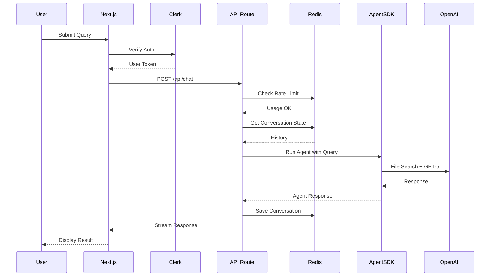
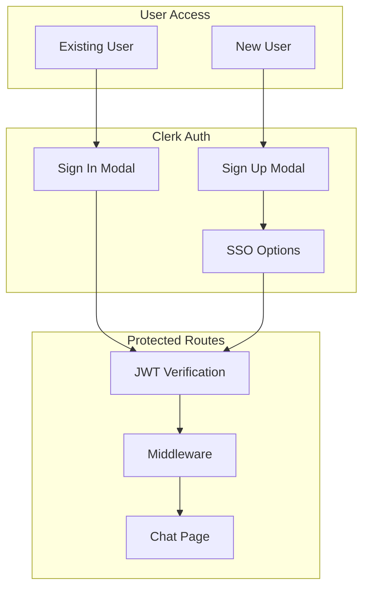
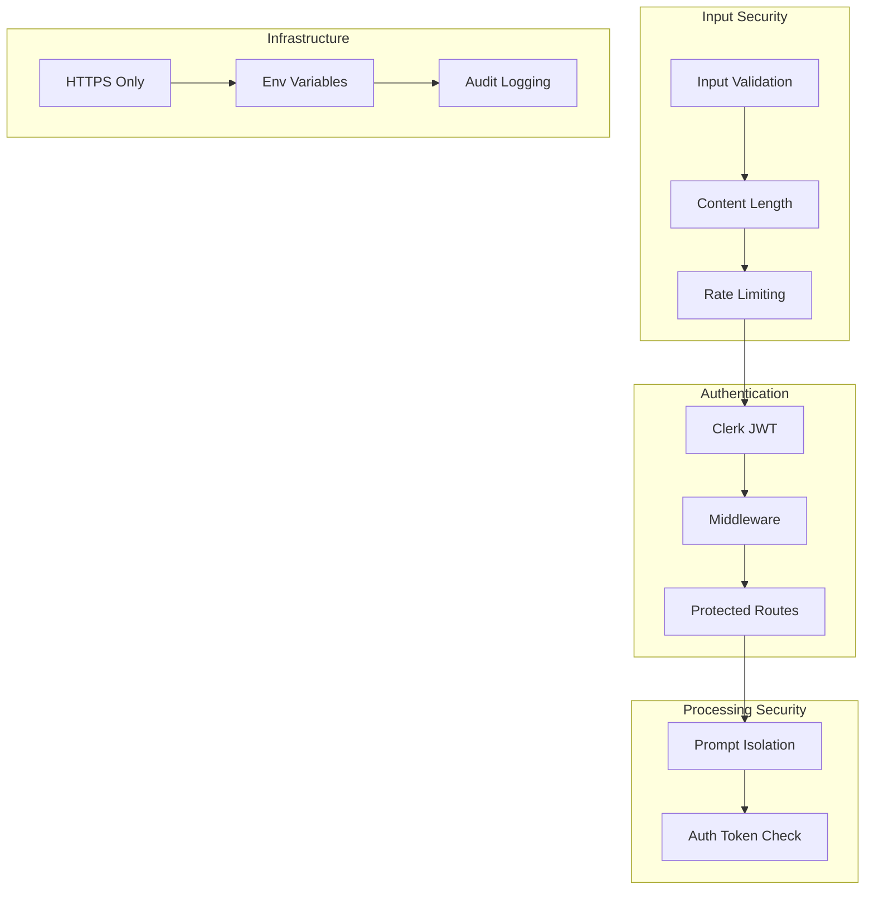
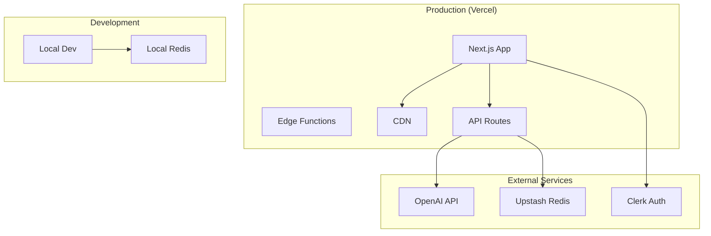

# AI Resume - Architecture Design

## Intelligent Career Assistant Platform

**Version:** 1.0
**Date:** November 2024
**Author:** Daniel McCarthy

---

## Executive Summary

This document outlines the production architecture for an AI-powered Resume Assistant that demonstrates modern AI engineering capabilities while serving as an interactive career showcase. The system leverages OpenAI's AgentSDK with File Search for Retrieval-Augmented Generation (RAG) to provide accurate, contextual responses about professional experience.

The architecture prioritizes **production readiness, operational efficiency, and modern best practices** through a carefully selected technology stack featuring Next.js 15, OpenAI AgentSDK, Clerk authentication, and Upstash Redis.

### Architectural Philosophy

Built on the principle of **intelligent simplification**—choosing managed services and proven frameworks to maximize reliability while minimizing operational overhead. Each technology choice demonstrates production-grade decision-making focused on performance, scalability, and maintainability.

---

## 1. System Purpose

The AI Resume Assistant serves three core objectives:

**Functional Goal**: Answer questions about professional experience with high accuracy and contextual relevance using AI-powered conversation.

**Technical Demonstration**: Showcase expertise in building production AI systems through the implementation itself with modern best practices (2024-2025).

**User Experience**: Provide an engaging, conversational interface that feels natural and responsive with excellent UX/UI design.

---

## 2. Design Principles

The architecture follows these principles:

- **Intelligent Service Selection**: Leverage managed services where they provide superior value over custom implementations
- **Observable by Default**: Built-in observability through OpenAI Usage API and comprehensive logging
- **Security in Depth**: Multi-layer security with authentication, rate limiting, and input validation
- **Modular Design**: Components can be upgraded or replaced independently
- **Cost Protected**: Authentication, rate limiting, and conversation state management to prevent runaway costs
- **Production Ready**: Error handling, monitoring, and graceful degradation

---

## 3. Technology Stack

| Component            | Technology                | Rationale                                                          |
| -------------------- | ------------------------- | ------------------------------------------------------------------ |
| **Frontend**         | Next.js 15 + App Router   | Modern React framework, server components, streaming support       |
| **UI Library**       | shadcn/ui + Tailwind CSS  | Beautiful, accessible components with full customization           |
| **Authentication**   | Clerk                     | Enterprise-grade auth, handles user management, JWT tokens         |
| **AI Agent**         | OpenAI AgentSDK           | Production agent framework with reasoning and tool orchestration   |
| **LLM**              | GPT-5 (o3-mini)           | Latest model with advanced reasoning capabilities                  |
| **RAG**              | OpenAI File Search        | Managed vector search with automatic chunking and hybrid retrieval |
| **State Management** | Vercel KV (Upstash Redis) | Serverless Redis for conversation state (7-day TTL)                |
| **Rate Limiting**    | Upstash Redis             | Fast, reliable usage tracking with token bucket algorithm          |
| **Deployment**       | Vercel                    | Edge deployment, zero-config, excellent DX                         |

---

## 4. System Architecture

### 4.1 High-Level Architecture

```mermaid
graph TB
    subgraph "Client Layer"
        U[User Browser]
    end

    subgraph "Edge Layer (Vercel)"
        N[Next.js 15 Frontend]
        API[Next.js API Routes]
        C[Clerk Auth Middleware]
    end

    subgraph "AI Layer"
        Agent[OpenAI AgentSDK]
        GPT[GPT-5 o3-mini]
        FS[File Search Tool]
        VS[Vector Store]
    end

    subgraph "Data Layer"
        Redis[Upstash Redis]
        RL[Rate Limiter]
        CS[Conversation State]
    end

    U --> N
    N --> C
    N --> API
    API --> RL
    API --> CS
    API --> Agent
    Agent --> GPT
    Agent --> FS
    FS --> VS
    RL --> Redis
    CS --> Redis

    style Agent fill:#10a37f
    style Redis fill:#dc382d
    style N fill:#000
```



### 4.2 Request Flow Sequence



---

## 5. Frontend Architecture

### 5.1 Technology Choices

**Next.js 15 App Router**:

- React Server Components for optimal performance
- Streaming support for real-time responses
- Built-in routing and API routes
- Edge runtime capabilities

**shadcn/ui Components**:

- High-quality, accessible components
- Fully customizable with Tailwind CSS
- Dark mode support built-in
- Modern design patterns

**Theme Management**:

- next-themes for dark/light/system mode
- Persistent theme preference
- No flash of unstyled content

### 5.2 Component Structure

```
src/
├── app/
│   ├── page.tsx                 # Landing page
│   ├── chat/page.tsx            # Chat interface (protected)
│   ├── layout.tsx               # Root layout with providers
│   ├── globals.css              # Global styles
│   └── api/
│       ├── chat/route.ts        # Main chat endpoint
│       ├── usage/route.ts       # Usage stats
│       └── conversation/
│           └── clear/route.ts   # Clear history
├── components/
│   ├── chat-interface.tsx       # Main chat component
│   ├── message-list.tsx         # Message display with markdown
│   ├── chat-input.tsx           # Auto-resizing input
│   ├── usage-display.tsx        # Quota badge
│   ├── theme-toggle.tsx         # Dark mode toggle
│   ├── theme-provider.tsx       # Theme context
│   └── ui/                      # shadcn/ui components
├── lib/
│   ├── agent.ts                 # AgentSDK integration
│   ├── conversation.ts          # State management
│   ├── rate-limit.ts            # Rate limiting logic
│   └── utils.ts                 # Utilities
└── middleware.ts                # Clerk auth middleware
```

### 5.3 State Management

**Conversation State**: Managed through local React state + Vercel KV persistence

**User State**: Clerk provides user context and authentication state

**Usage State**: Real-time rate limit tracking with Redis

**Theme State**: next-themes provider with localStorage persistence

---

## 6. OpenAI AgentSDK Integration

### 6.1 Agent Configuration

The AgentSDK provides a production-grade agent framework with:

**Core Features:**

- GPT-5 (o3-mini) with reasoning capabilities (medium effort)
- File Search tool for RAG
- Conversation history management
- Automatic tool orchestration
- Built-in tracing and debugging

**Agent Definition:**

```typescript
import { fileSearchTool, Agent } from '@openai/agents';

const fileSearch = fileSearchTool([
  'vs_69155bf00b7c8191a3211649ff529741', // Vector store ID
]);

const daniel = new Agent({
  name: 'Daniel',
  instructions: `[Comprehensive persona prompt]`,
  model: 'gpt-5',
  tools: [fileSearch],
  modelSettings: {
    reasoning: {
      effort: 'medium',
      summary: 'auto',
    },
    store: true,
  },
});
```

### 6.2 File Search RAG

**Managed RAG Features:**

- **Chunking**: 800 tokens per chunk, 400 token overlap (optimized for retrieval)
- **Embedding**: text-embedding-3-large at 256 dimensions
- **Hybrid Search**: Semantic (vector) + keyword (BM25-like sparse matching)
- **Reciprocal Rank Fusion**: Balances embedding vs text matching
- **Query Rewriting**: Optional automatic query optimization
- **Score Threshold**: 0.0-1.0 to filter low-quality results
- **Results**: Up to 50 max per query

**Advantages of OpenAI File Search:**

- Automatic chunking with optimal overlap
- Hybrid search out of the box
- No vector database to manage
- Built-in query optimization
- Zero operational overhead

### 6.3 Conversation Management

**History Handling:**

```typescript
export async function runDanielAgent(
  userMessage: string,
  conversationHistory: AgentInputItem[] = []
): Promise<{
  response: string;
  updatedHistory: AgentInputItem[];
  reasoning?: string;
}> {
  const newUserItem: AgentInputItem = {
    role: "user",
    content: [{ type: "input_text", text: userMessage }]
  };

  const fullHistory = [...conversationHistory, newUserItem];
  const runner = new Runner({ traceMetadata: {...} });
  const result = await runner.run(daniel, fullHistory);

  return {
    response: result.finalOutput ?? "",
    updatedHistory: [...fullHistory, ...result.newItems.map(i => i.rawItem)],
    reasoning: extractReasoning(result)
  };
}
```

---

## 7. Authentication & Usage Management

### 7.1 Authentication Flow

**Clerk Integration:**



**Middleware Protection:**

```typescript
import { clerkMiddleware, createRouteMatcher } from '@clerk/nextjs/server';

const isPublicRoute = createRouteMatcher(['/']);

export default clerkMiddleware(async (auth, request) => {
  if (!isPublicRoute(request)) {
    await auth.protect();
  }
});
```

### 7.2 Usage Limits

Production-grade rate limiting to prevent abuse and control costs:

| User Type           | Daily Messages | Requests/Min |
| ------------------- | -------------- | ------------ |
| **Unauthenticated** | 0              | 0            |
| **Authenticated**   | 100            | 10           |

### 7.3 Rate Limiting Implementation

**Token Bucket Algorithm with Upstash Redis:**

```typescript
import { Ratelimit } from '@upstash/ratelimit';
import { kv } from '@vercel/kv';

// 10 requests per minute
export const ratelimitPerMinute = new Ratelimit({
  redis: kv,
  limiter: Ratelimit.slidingWindow(10, '1 m'),
  analytics: true,
  prefix: 'ratelimit:minute',
});

// 100 requests per day
export const ratelimitPerDay = new Ratelimit({
  redis: kv,
  limiter: Ratelimit.slidingWindow(100, '1 d'),
  analytics: true,
  prefix: 'ratelimit:day',
});
```

**Performance:** Sub-millisecond Redis latency

**User Feedback:** Clear quota indicators, progressive warnings

---

## 8. Security Architecture

### 8.1 Defense Layers



### 8.2 Security Measures

**Input Layer:**

- Message length limits (3000-4000 characters)
- Type validation (string only)
- Clerk authentication required for all API routes

**Processing Layer:**

- JWT token verification on every request
- User isolation (conversation state per user)
- OpenAI's built-in content moderation

**Infrastructure:**

- HTTPS enforcement via Vercel
- Environment variables for secrets
- No API keys exposed to client
- Audit logging for all requests

---

## 9. Observability Strategy

### 9.1 Monitoring Approach

**OpenAI Usage API:**

- Track token usage by minute/hour/day
- Cost tracking per user/conversation
- Filter by model, API key, project ID

**Custom Logging:**

```typescript
// Log each chat interaction
{
  userId: string,
  timestamp: Date,
  query: string,
  responseLatency: number,
  tokensUsed: number,
  estimatedCost: number,
  rateLimitStatus: {
    minuteRemaining: number,
    dayRemaining: number
  }
}
```

**Metrics Dashboard (Future):**

- Daily active users
- Query patterns and topics
- Average response time
- Cost per conversation
- Cache effectiveness

### 9.2 Key Metrics

**Performance Metrics:**

- Response latency (target: <2 seconds)
- Time to first token (target: <500ms)
- API availability (target: 99.9%)

**Business Metrics:**

- Daily active users
- Messages per user
- Popular query topics
- User satisfaction (implicit feedback)

**Cost Metrics:**

- Cost per conversation (target: <$0.02)
- Token consumption trends
- Storage costs

---

## 10. Chat UI/UX Best Practices (2024-2025)

### 10.1 Modern Interface Patterns

**Message Display:**

- Rounded bubbles (16px border-radius) for modern appearance
- User messages: right-aligned, primary color background
- Assistant messages: left-aligned, muted background
- Max-width 85% to prevent excessive line lengths
- Proper spacing: 24px between message groups

**Typography:**

- Font size: 14-16px for readability
- Line-height: 1.5-1.6 for comfortable reading
- Prose styling with proper hierarchy
- Dark mode optimized contrast ratios (WCAG AA)

**Avatars:**

- 32px circular avatars
- Initials with brand color background
- Positioned at message start

### 10.2 Interactive Features

**Code Syntax Highlighting:**

- Language-aware syntax highlighting
- Copy button on hover
- Theme-aware (dark/light code themes)
- Inline code with subtle background

**Suggested Questions:**

- Displayed on empty state
- Auto-submit on click
- Contextual and diverse
- Proper button styling and spacing

**Loading States:**

- Animated typing indicator (3 dots)
- Bounce animation with staggered delays
- Theme-aware colors

**Auto-Scroll:**

- Automatically scrolls to newest message
- Maintains position when scrolling up
- Smooth scrolling behavior

### 10.3 Dark Mode Support

**Implementation:**

- System preference detection
- Manual toggle (sun/moon icon)
- Persistent preference (localStorage)
- No flash of unstyled content
- All components theme-aware

**Benefits:**

- Reduces eye strain in low light
- Modern user expectation
- Accessibility enhancement
- Battery savings on OLED

---

## 11. Deployment Architecture

### 11.1 Infrastructure Layout



### 11.2 Deployment Process

**Vercel Deployment:**

1. Git push to main branch
2. Automatic build triggered
3. Environment variables configured
4. Edge deployment globally
5. Zero-downtime updates

**Environment Configuration:**

```bash
# Production Environment Variables
OPENAI_API_KEY=sk-...
NEXT_PUBLIC_CLERK_PUBLISHABLE_KEY=pk_...
CLERK_SECRET_KEY=sk_...
UPSTASH_REDIS_REST_URL=https://...
UPSTASH_REDIS_REST_TOKEN=...
KV_REST_API_URL=https://...       # Same as Upstash
KV_REST_API_TOKEN=...             # Same as Upstash
KV_URL=https://...                # Same as Upstash
```

---

## 12. Performance Optimization

### 12.1 Response Time Optimization

**Target Metrics:**

- Time to first byte: <200ms
- Complete response: <2 seconds
- Streaming first chunk: <500ms

**Optimization Techniques:**

- Edge deployment for low latency
- Streaming responses from OpenAI
- Redis caching for conversation state
- Connection pooling to Redis

### 12.2 Cost Optimization

**Token Management:**

- Efficient system prompts
- Conversation history pruning (keep last N messages)
- File Search reduces token usage vs full document in context

**Rate Limiting Benefits:**

- Prevents abuse and cost spikes
- 10 req/min, 100 msg/day limits
- Clear user feedback on quotas

**Monitoring:**

- OpenAI Usage API for cost tracking
- Daily spending alerts
- Per-user cost attribution

---

## 13. Architecture Benefits

### 13.1 Key Advantages

**Operational Excellence:**

- Minimal infrastructure management
- Automatic scaling via managed services
- Built-in monitoring and observability
- Zero-downtime deployments

**Development Velocity:**

- Rapid iteration with modern frameworks
- Type-safe TypeScript throughout
- Comprehensive error handling
- Clear separation of concerns

**Cost Efficiency:**

- Pay-per-use pricing models
- Efficient resource utilization
- Automated cost controls (rate limiting)
- Monthly operational costs: $15-30

**Production Quality:**

- Enterprise-grade authentication
- Multi-layer security
- Comprehensive error handling
- Performance monitoring

### 13.2 Technical Sophistication

**Modern AI Engineering:**

- Production agent framework (OpenAI AgentSDK)
- Advanced RAG with hybrid search
- Conversation state management
- Reasoning transparency (GPT-5 o3-mini)

**Frontend Excellence:**

- 2024-2025 UX best practices
- Accessibility compliance (WCAG AA)
- Dark mode support
- Responsive design
- Real-time streaming

**Backend Reliability:**

- Edge deployment for low latency
- Token bucket rate limiting
- Redis-backed state persistence
- Graceful error handling

---

## 14. Success Metrics

### Technical Performance

✅ Response time < 2 seconds (p95)
✅ Streaming first chunk < 500ms
✅ Zero security incidents
✅ 99.9% uptime (Vercel SLA)

### User Experience

✅ Modern chat interface (2024-2025 best practices)
✅ Dark mode support
✅ Code syntax highlighting
✅ Auto-scroll behavior
✅ Suggested questions
✅ Mobile responsive

### Cost Management

✅ Rate limiting prevents abuse
✅ Average cost per conversation < $0.02
✅ Monthly costs < $30 at current scale
✅ Clear usage quotas

---

## 15. Risk Management

### Technical Risks

**OpenAI API Outages**

- Mitigation: Error handling with clear user feedback, retry logic
- Impact: Temporary service interruption
- Likelihood: Low (99.9% uptime SLA)

**Cost Overruns**

- Mitigation: Hard rate limits (10 req/min, 100 msg/day)
- Impact: Prevented through quotas
- Likelihood: Very low with current limits

**Performance Degradation**

- Mitigation: Monitoring, streaming responses, edge deployment
- Impact: User experience affected
- Likelihood: Low with current architecture

### Operational Risks

**Abuse Attempts**

- Mitigation: Authentication required, rate limiting, pattern detection
- Impact: Prevented through security layers
- Likelihood: Low with auth requirement

**Data Privacy**

- Mitigation: User isolation, no PII storage, Clerk manages auth
- Impact: Compliance and trust
- Likelihood: Very low with current design

---

## 16. Future Enhancements (Optional)

### Phase 1: Enhanced Analytics

- User engagement metrics
- Popular question tracking
- A/B testing for prompts
- Cost analysis dashboard

### Phase 2: Advanced Features

- Voice input support
- Multi-language support
- Conversation export/sharing
- Message reactions

### Phase 3: Scale Optimization

- Virtual scrolling for long conversations (100+ messages)
- In-app search functionality
- Conversation branching
- Image/file upload support

---

## Conclusion

This architecture demonstrates production-grade AI engineering through careful technology selection, comprehensive security measures, and modern UX best practices. The system achieves:

- **High Performance**: Sub-2-second responses with streaming
- **Cost Efficiency**: <$30/month operational costs
- **Production Reliability**: Built-in security, rate limiting, monitoring
- **Excellent Developer Experience**: Clean architecture, type safety
- **Modern UX**: 2024-2025 best practices for chat interfaces

The architecture serves as both a functional tool and a portfolio piece, showcasing the ability to design and build production-grade AI systems with appropriate technology choices, security considerations, and operational excellence.

**Key Achievement:** Production-ready AI application with enterprise-grade features, modern UX, and operational efficiency.

---

## Appendix A: Environment Setup

### Development Environment

```bash
# Install dependencies
npm install

# Configure environment
cp .env.example .env.local
# Add your API keys

# Run development server
npm run dev
```

### Production Deployment

```bash
# Deploy to Vercel
vercel

# Configure environment variables in Vercel dashboard
# Enable Vercel KV (Upstash Redis)
# Deploy
vercel --prod
```

---

## Appendix B: Key Files Reference

| File                                | Purpose              | Lines of Code |
| ----------------------------------- | -------------------- | ------------- |
| `src/lib/agent.ts`                  | AgentSDK integration | ~150          |
| `src/lib/conversation.ts`           | State management     | ~50           |
| `src/lib/rate-limit.ts`             | Rate limiting        | ~45           |
| `src/app/api/chat/route.ts`         | Main API endpoint    | ~85           |
| `src/components/chat-interface.tsx` | Chat UI              | ~160          |
| `src/components/message-list.tsx`   | Message display      | ~150          |
| **Total Core Logic**                |                      | **~640 LOC**  |

---

**Document Version:** 1.0
**Last Updated:** November 14, 2024
**Status:** Production Ready ✅
