# AI Resume Architecture Design
## Intelligent Career Assistant Platform

**Version:** 5.0  
**Date:** November 2025  
**Author:** Daniel McCarthy

---

## Executive Summary

This document outlines the architecture for an AI-powered Resume Assistant that demonstrates production-grade AI engineering capabilities while serving as an interactive career showcase. The system uses Retrieval-Augmented Generation (RAG) to provide accurate, contextual responses about professional experience.

The architecture prioritises production readiness, security, observability, and cost protection through a modern stack featuring Next.js, Portkey AI Gateway, and Pinecone vector database.

---

## 1. System Purpose

The AI Resume Assistant serves three core objectives:

**Functional Goal**: Answer questions about professional experience with high accuracy and contextual relevance

**Technical Demonstration**: Showcase expertise in building production AI systems through the implementation itself

**User Experience**: Provide an engaging, conversational interface that feels natural and responsive

---

## 2. Architecture Philosophy

The design follows these principles:

- **Simplicity First**: Proven patterns with complexity added only where it adds clear value
- **Observable by Default**: Complete visibility through Portkey's comprehensive observability
- **Security in Depth**: Multiple layers of protection against prompt injection and abuse
- **Modular Design**: Components can be upgraded or replaced independently
- **Cost Protected**: Authentication, rate limiting, and intelligent caching to prevent runaway costs

---

## 3. Technology Stack

| Component | Technology | Rationale |
|-----------|------------|-----------|
| **Frontend** | Next.js 15 + shadcn/ui | Modern stack, excellent DX, full control over UX |
| **Authentication** | Clerk | Simple integration, handles user management |
| **AI Gateway** | Portkey | Unified API for 250+ models, built-in observability, semantic caching |
| **Backend API** | FastAPI + Python 3.12 | Async support, comprehensive AI library ecosystem |
| **Orchestration** | LangGraph | Superior workflow management for complex RAG pipelines |
| **Vector Database** | Pinecone Serverless | Zero operational overhead, automatic scaling |
| **Knowledge Graph** | Neo4j AuraDB | Managed graph database for relationship queries |
| **Rate Limiting** | Redis | Fast, reliable usage tracking |
| **Deployment** | Railway (Backend) + Vercel (Frontend) | Simple deployment, good free tiers |

---

## 4. System Architecture

### 4.1 High-Level Architecture

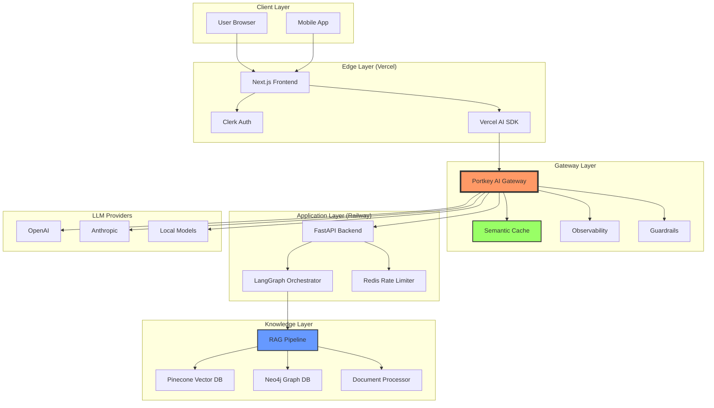

### 4.2 Request Flow Sequence

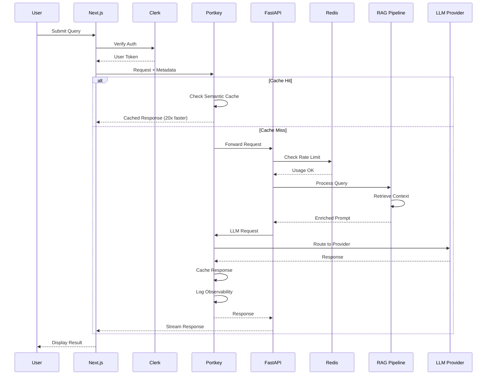

---

## 5. Frontend Architecture

### 5.1 Technology Choices

**Next.js 15 App Router**: Latest features including React Server Components and streaming

**shadcn/ui Components**: High-quality, customisable components built on Radix UI

**Vercel AI SDK**: Streaming responses, built-in error handling, provider abstraction

**TanStack Query**: Efficient data fetching and caching on the client side

### 5.2 Component Structure

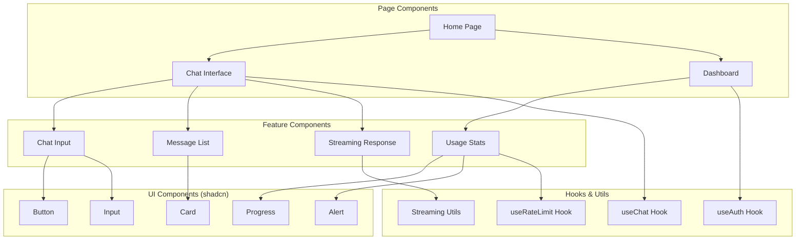

### 5.3 State Management

**Conversation State**: Managed through Vercel AI SDK's useChat hook

**User State**: Clerk provides user context and authentication state

**Usage State**: Custom hooks fetch and cache usage data from backend

**UI State**: Local component state for optimistic updates

---

## 6. Portkey Integration

### 6.1 Gateway Configuration

Portkey fully adheres to the OpenAI SDK signature, allowing instant switching with production features out of the box. The integration provides:

**Unified API Access**: Connect to over 250 LLM providers through a unified API with fallbacks, load balancing, and caching capabilities

**Semantic Caching**: Early tests reveal a 20% cache hit rate at 99% accuracy for Q&A use cases, with cached responses served 20x faster

**Comprehensive Observability**: Detailed observability features providing deep insights into traces, errors, and caching

### 6.2 Implementation Architecture

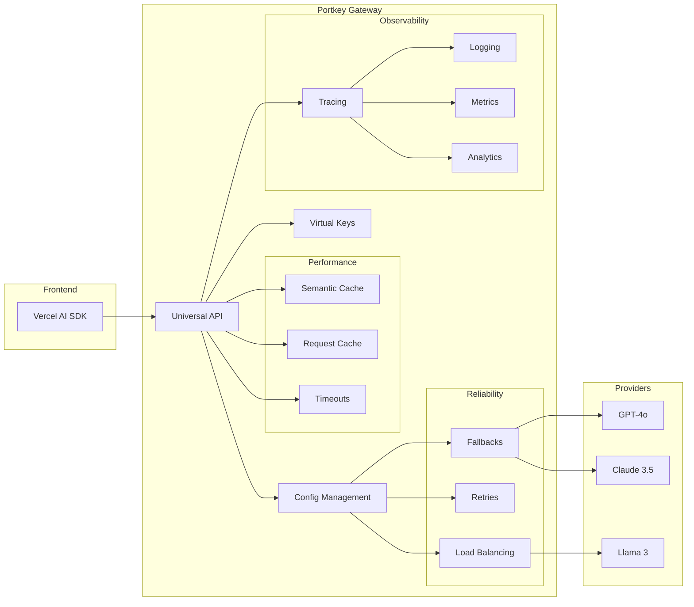

### 6.3 Configuration Strategy

**Virtual Keys**: Secure API key management without exposing provider credentials

**Metadata Tracking**: Custom metadata for user sessions, conversation tracking, and analytics

**Cache Namespacing**: Custom cache namespaces allow partitioning cache based on custom strings, providing finer control over cached data

---

## 7. RAG Architecture

### 7.1 Document Processing Pipeline

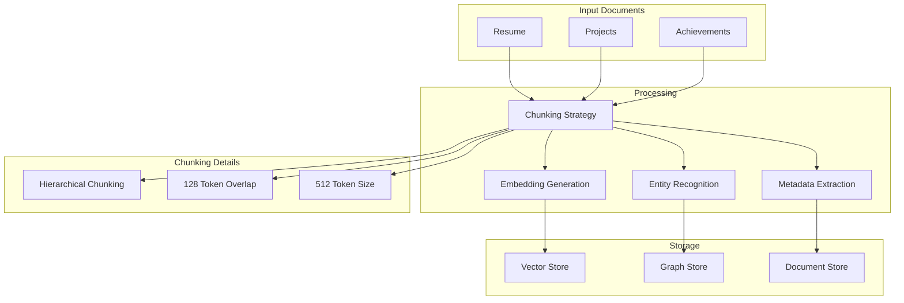

### 7.2 Retrieval Strategy

**Hybrid Search Pipeline**:
- Dense retrieval using embedding similarity (Pinecone)
- Sparse retrieval with BM25 keyword matching
- Graph queries for relationship-based retrieval (Neo4j)
- Metadata filtering by date, company, technology

**Query Processing**:
- Intent classification to route queries appropriately
- Query expansion using synonyms and related terms
- Hypothetical Document Embeddings (HyDE) for better semantic matching

**Re-ranking**:
- Cross-encoder models for precise relevance scoring
- Diversity sampling to avoid redundant information
- Context window optimisation for token efficiency

### 7.3 Knowledge Graph Structure

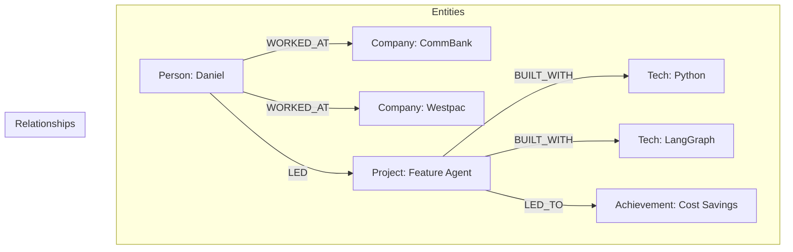

---

## 8. Authentication & Usage Management

### 8.1 Authentication Flow

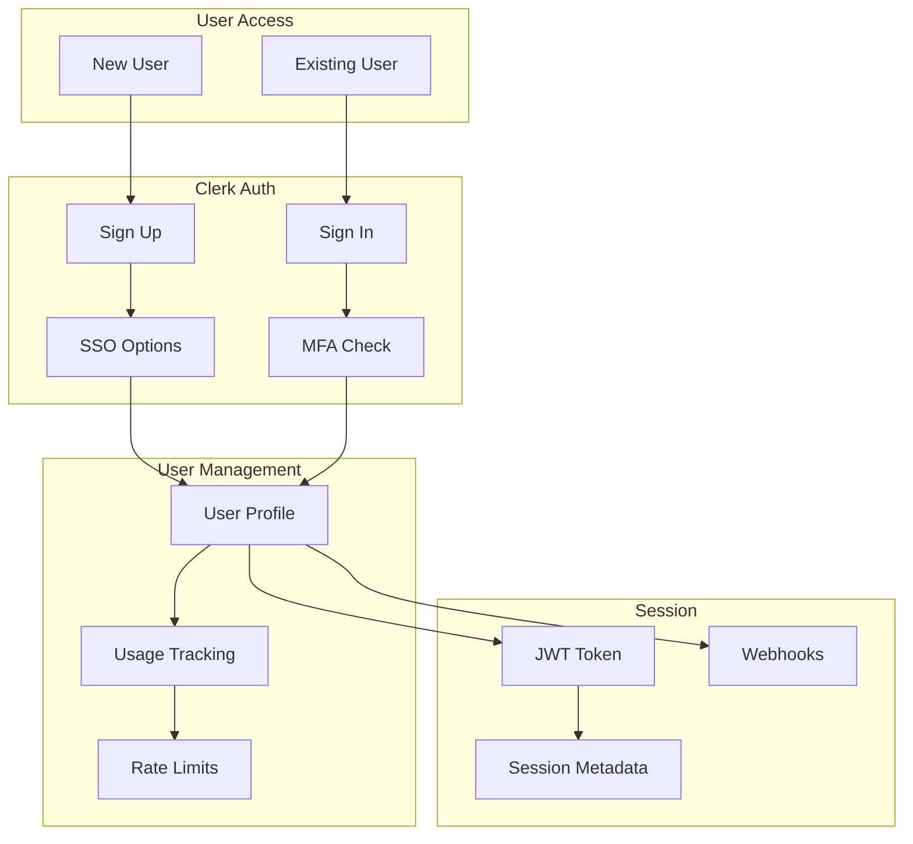

### 8.2 Usage Limits

Simple daily limits to prevent cost overruns:

| User Type | Daily Messages | Daily Tokens | Requests/Min |
|-----------|---------------|--------------|--------------|
| **Unauthenticated** | 0 | 0 | 0 |
| **Authenticated** | 100 | 100,000 | 10 |

### 8.3 Rate Limiting Implementation

**Token Bucket Algorithm**: Redis-backed with millisecond response times

**Usage Feedback**: Clear indicators showing remaining quota and reset times

**Graceful Degradation**: Progressive warnings as users approach limits

---

## 9. Security Architecture

### 9.1 Defense Layers

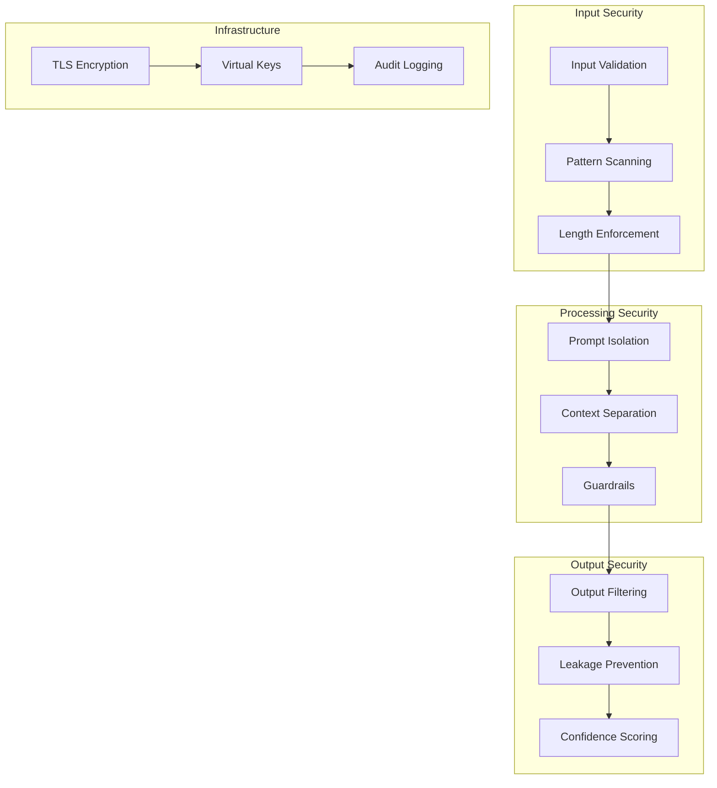

### 9.2 Prompt Injection Defense

**Input Layer**: Pattern matching, character validation, encoding normalisation

**Processing Layer**: System prompt isolation, separate user context, Portkey guardrails

**Output Layer**: Response validation, information leakage prevention

---

## 10. Observability Strategy

### 10.1 Portkey Observability Stack

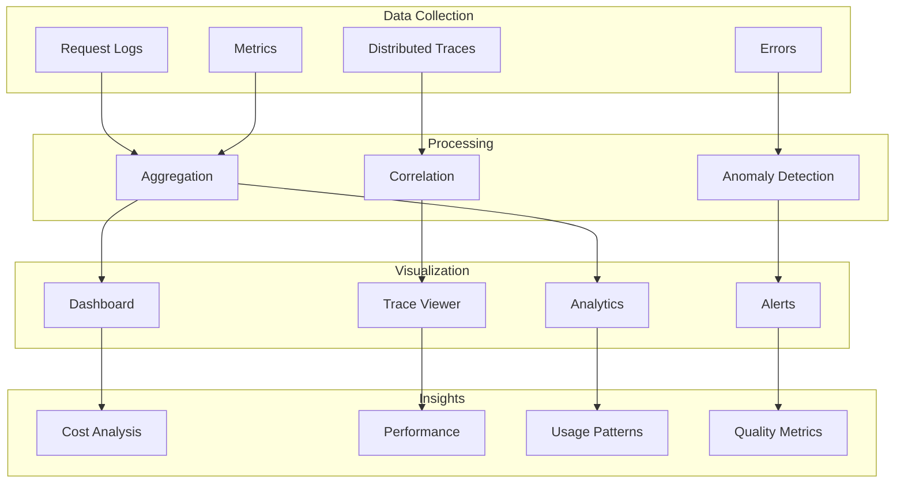

### 10.2 Key Metrics

**Performance Metrics**:
- Response latency (p50, p95, p99)
- Cache hit rates (target: 20%)
- Token consumption per request
- Streaming time to first token

**Business Metrics**:
- Daily active users
- Query patterns and topics
- User satisfaction (implicit feedback)
- Cost per conversation

**System Health**:
- Error rates by component
- Provider availability
- Rate limit utilisation
- Cache effectiveness

---

## 11. Deployment Architecture

### 11.1 Infrastructure Layout

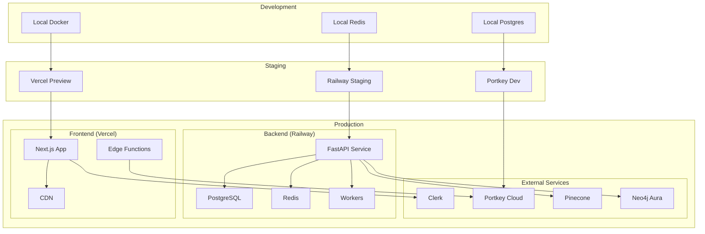

### 11.2 CI/CD Pipeline

```mermaid
graph LR
    subgraph "Code Phase"
        CM[Commit]
        PR[Pull Request]
    end
    
    subgraph "Build Phase"
        LI[Lint]
        TS[Type Check]
        UT[Unit Tests]
        BLD[Build]
    end
    
    subgraph "Test Phase"
        IT[Integration Tests]
        SEC[Security Scan]
        PC[Performance Check]
    end
    
    subgraph "Deploy Phase"
        STG[Deploy Staging]
        SMK[Smoke Tests]
        PRD[Deploy Production]
        RAG[Update RAG Data]
    end
    
    CM --> PR
    PR --> LI
    LI --> TS
    TS --> UT
    UT --> BLD
    BLD --> IT
    IT --> SEC
    SEC --> PC
    PC --> STG
    STG --> SMK
    SMK --> PRD
    PRD --> RAG
```

### 11.3 Environment Configuration

**Development**: Local development with hot reload and debug tools

**Staging**: Production-like environment for testing

**Production**: Optimised for performance and reliability

---

## 12. Performance Optimisation

### 12.1 Caching Strategy

**Portkey Semantic Cache**: 20% cache hit rate delivering responses 20x faster at zero additional cost

**Application Cache**:
- Embedding cache for repeated queries
- User session cache in Redis
- Static asset caching via CDN

### 12.2 Latency Optimisation

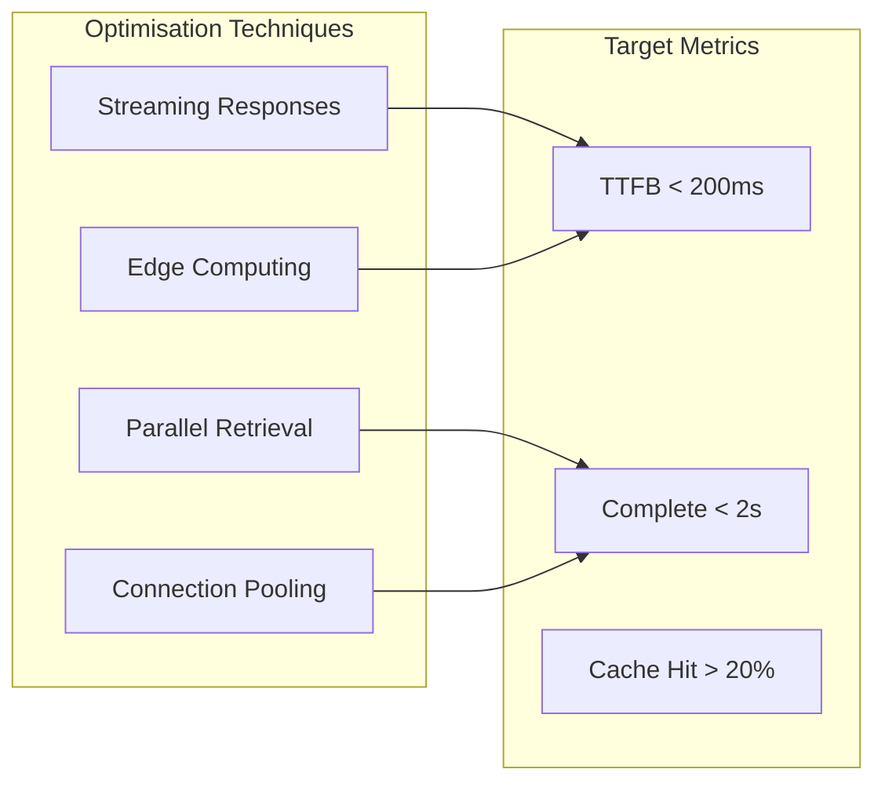

### 12.3 Cost Optimisation

**Token Management**:
- Efficient prompt design
- Context window optimisation
- Smart truncation strategies

**Caching Benefits**:
- 20% reduction in API calls via semantic cache
- Reduced latency improves user experience
- Lower operational costs

---

## 13. Development Roadmap

### Phase 1: Core Foundation (Weeks 1-2)
- Basic Next.js frontend with shadcn/ui
- Clerk authentication integration
- Portkey setup with virtual keys
- Basic RAG pipeline
- Redis rate limiting

### Phase 2: Enhancement (Week 3)
- Knowledge graph integration
- Advanced retrieval strategies
- Semantic caching configuration
- Streaming response implementation
- Usage analytics dashboard

### Phase 3: Production Hardening (Week 4)
- Security implementation and testing
- Performance optimisation
- Comprehensive error handling
- Documentation completion
- Deployment automation

### Phase 4: Growth Features (Post-Launch)
- Voice interface
- Multi-language support
- Advanced analytics
- A/B testing for prompts

---

## 14. Success Metrics

### Technical Performance
- Response time < 2 seconds (p95)
- Cache hit rate > 20%
- Retrieval accuracy > 90%
- Zero security incidents
- 99.9% uptime

### User Experience
- Time to first token < 500ms
- Conversation completion rate > 80%
- No abuse incidents
- Positive user feedback

### Cost Management
- Average cost per conversation < $0.02
- Cache savings > 20% of LLM costs
- Sustainable token consumption
- Efficient resource utilisation

---

## 15. Risk Management

### Technical Risks

**Model Hallucination**
- Mitigation: Strict RAG grounding, Portkey guardrails, confidence scoring

**Performance Issues**
- Mitigation: Semantic caching, load balancing, monitoring

**Provider Outages**
- Mitigation: Portkey fallbacks, multi-provider support

### Operational Risks

**Cost Overruns**
- Mitigation: Hard usage limits, Portkey budget controls, semantic caching

**Abuse Attempts**
- Mitigation: Authentication requirement, rate limiting, pattern detection

**Data Loss**
- Mitigation: Regular backups, version control, disaster recovery plan

---

## 16. Integration Details

### 16.1 Portkey Configuration

**Initial Setup**:
- Create Portkey account and obtain API key
- Configure virtual keys for each LLM provider
- Set up semantic caching with 7-day TTL
- Configure fallback chains for reliability

**Request Flow**:
- Add trace IDs for conversation tracking
- Include user metadata for analytics
- Set cache namespace per user for personalisation
- Configure guardrails for content filtering

### 16.2 Data Flow

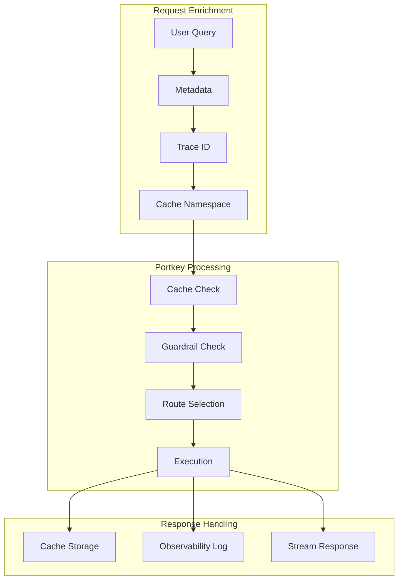

---

## Conclusion

This architecture provides a robust, production-ready foundation for an AI Resume Assistant that balances sophistication with simplicity. Through the strategic use of modern technologies—particularly the powerful combination of Next.js, Portkey, and Pinecone—the system achieves:

- **High Performance**: Sub-2-second responses with 20x faster cached queries
- **Cost Efficiency**: 20% reduction in LLM costs through intelligent caching
- **Production Reliability**: Built-in fallbacks, monitoring, and security
- **Excellent Developer Experience**: Clean architecture with comprehensive observability

The architecture serves as both a functional tool and a portfolio piece, demonstrating the ability to design and build production-grade AI systems with appropriate safeguards and optimisations.